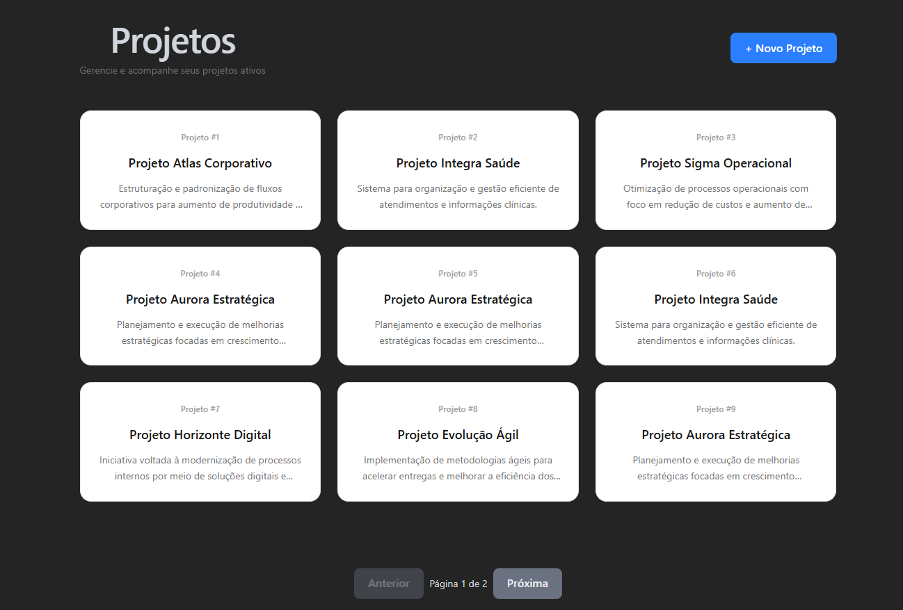
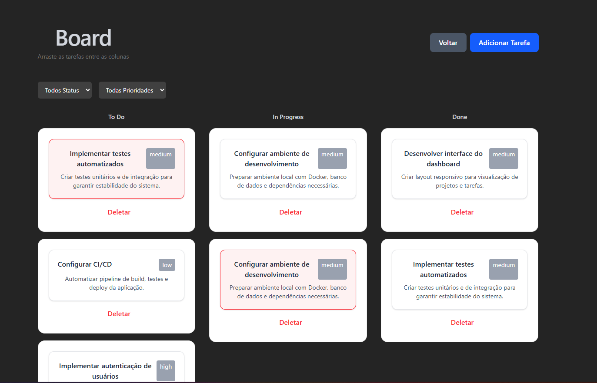

# Task manager

📊 Sistema full stack para gerenciamento de projetos e tarefas.
Desenvolvido com Laravel no backend e Vue 3 no frontend, seguindo boas práticas de arquitetura e ambiente Dockerizado.

## 📸 Previews




🚀 Tecnologias
- PHP 8.2+
- Laravel
- MySQL
- Docker
- PHPUnit (testes)

📦 Requisitos
Antes de começar, você precisa ter instalado:
- Docker
- Docker Compose
- Git

📁 Estrutura Docker
```bash
docker/
 ├── nginx/
 │   └── default.conf
 ├── php/
 │   └── Dockerfile
 └── mysql/
 docker-compose.yml
```

```bash
git clone https://github.com/quinho981/Task-manager.git
```
```bash
cd Task-manager
```

2️⃣ Suba os containers
```bash
docker compose up -d --build
```

Isso irá subir:
- PHP-FPM
- Nginx
- MySQL
- Vue3

Acesse o diretório backend e rode o comando para copiar o .env.example
```
cd backend
cp .env.example .env
```

3️⃣ Instalar dependências do Laravel
```bash
docker compose exec app composer install
```

4️⃣ Gerar a key da aplicação
```bash
docker compose exec app php artisan key:generate
```

5️⃣ Rodar as migrations e seeders
```bash
docker compose exec app php artisan migrate --seed
```

---

Acessando a aplicação
- http://localhost:5173/
- MySQL: localhost:3306

---

🧪 Rodando os testes
docker compose exec app php artisan test

---

📌 Decisões técnicas:
- Dockerização:
    - Padronização, facilita o onboarding e previne problemas de compatibilidade de versões.
- Arquitetura em camadas (Controller -> Service -> Model):
    - Adicionei o service layer para orquestrar a regra de negócios, aplicar regras e outras necessidades.
    - Controller: recebe a requisição e delega, evitando controllers inchados. Facilitando a manutenção e testes.
    - Service: Onde fica as regras de negócio.
    - Model: entidade e relacionamentos
- Paginação para melhorar performance, escalabilidade e evitar sobrecarga
- Rate limiting:
    - Proteção contra abuso de requisições
- API resource:
    - Defini os dados que serão retornados, além disso, utilizei o API resources para buscar dados de relacionamento, evitando problema como N+1 query
- Separação de camadas no frontend com views, componentes, stores, services etc.
- Gerenciamento de estado com pinia
    - Evita prop drilling, melhora a organização
- Tipagem no frontend com TS